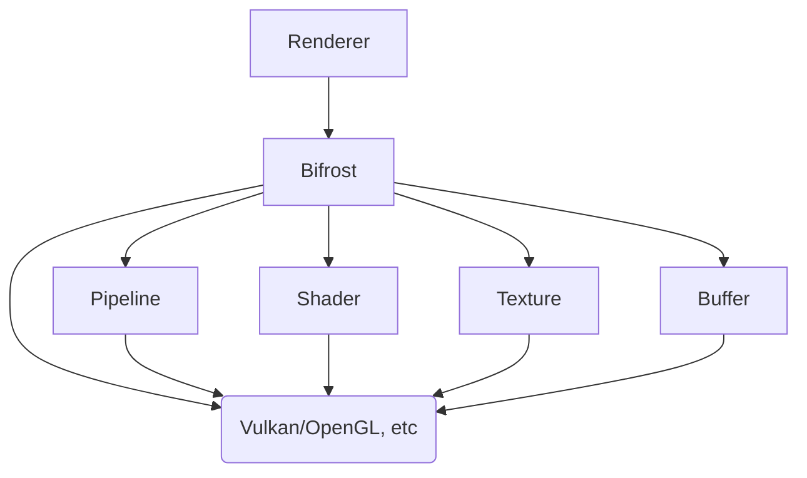

## Low level architecture

```mermaid
flowchart
Bifrost --> Buffer
Bifrost --> Pipeline 
Bifrost --> Shader
Bifrost --> Texture
Renderer --> Bifrost
Bifrost --> GraphicsAPI(Vulkan/OpenGL, etc)
Pipeline --> GraphicsAPI(Vulkan/OpenGL, etc)
Shader --> GraphicsAPI(Vulkan/OpenGL, etc)
Texture --> GraphicsAPI(Vulkan/OpenGL, etc)
Buffer --> GraphicsAPI(Vulkan/OpenGL, etc)

```

*\*Bifrost is a cool name for the Render Hardware Interface*

